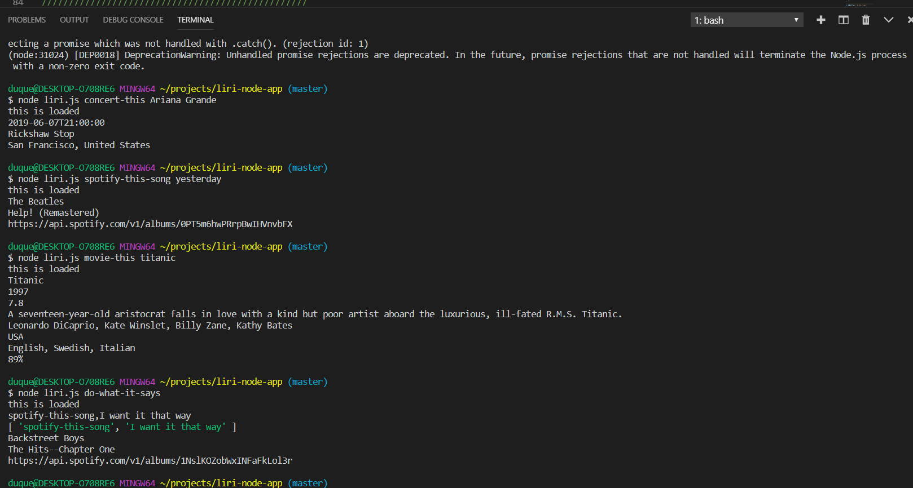

# liri-node-app
liri bot is an application that allows users to search for information about songs, movies and concerts using the command line or text file inputs

use the concert-this argument along with the artists name to get the date and location of upcoming concerts

 
use the spotify-this-song argument along with the song name to get information about the song

 
use the movie-this argument along with a movie name to get information about the movie

 
to input through the text file, type one of the above listed arguments (concert-this, spotify-this-song or movie-this) along with the artist song or movie seperated by a comma 
 

